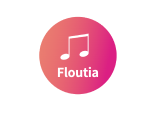
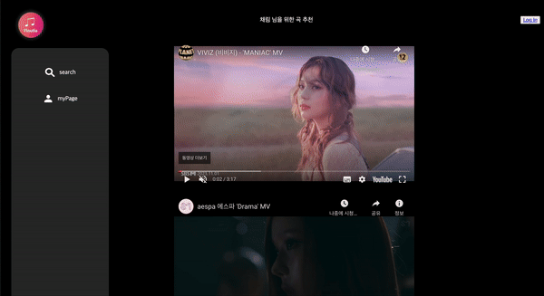
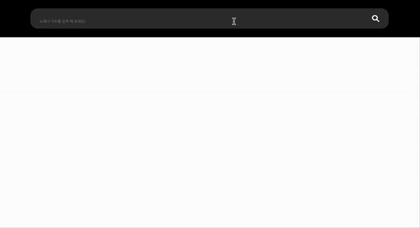
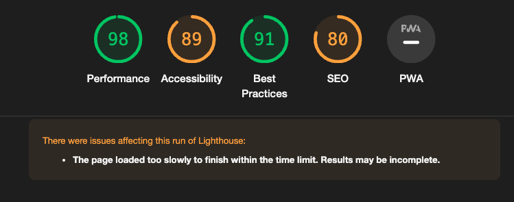
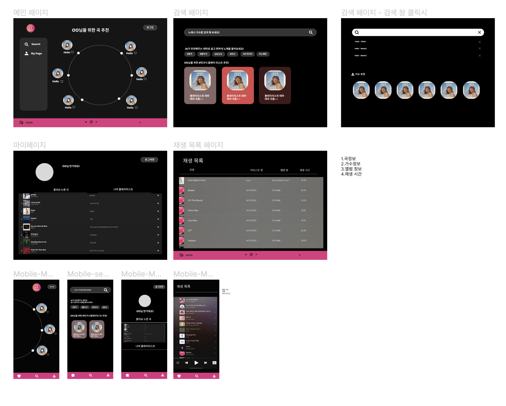

# Floutia

<center>

음악을 테마별로 검색해볼수 있는 서비스

&nbsp;

## 🖥️ 프로젝트 소개

&nbsp;
새싹인들을 위한 지식 공유 커뮤니티입니다.

[플루티아 서비스 바로가기](https://floutia.vercel.app/)

&nbsp;

## 🕰️ 개발 기간

23.12.11 - 24.01.05

</center>
&nbsp;

## 시작 가이드

### Requirements

### build

```bash
$ npm run build
```

&nbsp;

### ⚙️ 개발 환경

**[FE]**

- [언어] :
   
- [프레임워크 및 라이브러리]:
   
- [배포] : 
- [Open API] :
  

## 📌 화면 구성

|                                                                    |                                                                           |
| ------------------------------------------------------------------ | ------------------------------------------------------------------------- |
| 메인페이지                                                         | 검색페이지                                                                |
|  |  |

## Light House

- 테스트 결과



## 와이어 프레임

&nbsp;


## 주요 기능

&nbsp;

메인 페이지

- 추천 영상들 보여주기

&nbsp;
검색 페이지

- 검색 시 조건에 맞는 영상 보여주기

&nbsp;
마이페이지

- 업데이트 예정

&nbsp;

## 디렉토리 구조

```bash
📦app
 ┣ 📂components
 ┃ ┣ 📜PlayList.tsx
 ┃ ┣ 📜Sidebar.tsx
 ┃ ┣ 📜Template.tsx
 ┃ ┣ 📜header.tsx
 ┃ ┗ 📜mainCircle.jsx
 ┣ 📂myPage
 ┃ ┣ 📜layout.jsx
 ┃ ┗ 📜page.tsx
 ┣ 📂search
 ┃ ┣ 📂components
 ┃ ┃ ┗ 📜Search.jsx
 ┃ ┣ 📜layout.tsx
 ┃ ┗ 📜page.tsx
 ┣ 📂styles
 ┃ ┣ 📜page.module.css
 ┃ ┗ 📜variables.module.scss
 ┣ 📜.DS_Store
 ┣ 📜_app.tsx
 ┣ 📜favicon.ico
 ┣ 📜globals.css
 ┣ 📜layout.tsx
 ┗ 📜page.tsx
```
